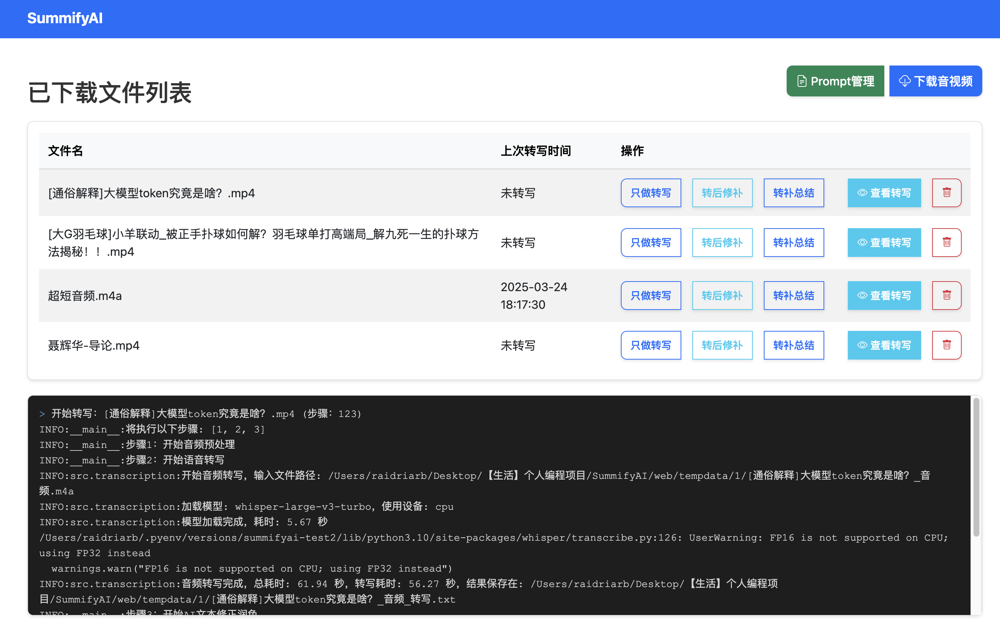
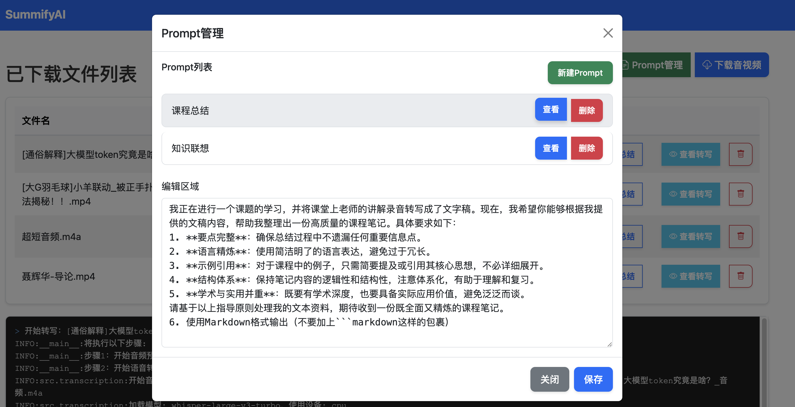
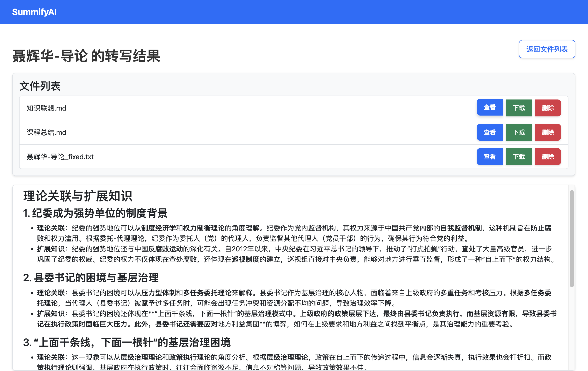

# SummifyAI

## 目录
- [简介](#简介)
- [功能特性](#功能特性)
- [安装说明](#安装说明)
- [使用方法](#使用方法)
  - [Web端使用](#web端使用)
  - [命令行使用](#命令行使用)
- [常见问题](#常见问题)
- [更新日志](#更新日志)

## 简介

你是否为长达几十分钟甚至一两小时的长视频网课感到头疼？这些视频整体信息密度不高，但偶尔却包含关键知识点，让人不知如何是好。

SummifyAI 能将音频或视频快速转写为文字，并通过自定义 prompt 进行总结精炼、笔记整理、摘要生成等一系列操作，大幅提升你的学习与工作效率。

## 功能特性

- 支持Windows、MacOS
- 支持多种音频和视频格式输入
- 基于whisper库在本地进行语音转写
- 调用 AI 智能添文本修正润色和修正文本，大幅提高准确性（可选用超便宜的deepseek！）
- 可自定义prompt，进行生成文本摘要和关键信息提取等一系列操作
- 分步骤处理，可灵活选择执行的功能
- Web端支持本地文件批量上传并建立任务
- Web端任务队列，避免并发资源占用
- 转写/总结输出统一为 Markdown（.md），并支持 Mermaid 渲染
- 转写结果支持在线查看与编辑保存
- 日志输出到 `logs/` 目录（可通过环境变量调整）
- Web端“刷新”按钮支持仅刷新状态





---


## 1 安装说明

- 需要Python 3.10+ 

```bash
# 建议使用虚拟环境（venv或者pyenv），具体方法自行搜索
pip install -r requirements.txt
```

安装后配置：
- 在 `.env` 或环境变量中配置 `API_KEY`（也可直接修改 `config.py`）
- prompts文件夹中，可编写多个txt文件，作为自定义的prompt，工具会分别处理。
- 其他高级配置可以暂时不用动
- **注意：首次使用需要下载whisper库的模型文件，模型文件大小从几十MB、几百MB到1.5GB左右不等**

## 2 使用方法

### 2.1 web端使用
```bash
cd web && python app.py
```
然后访问 http://127.0.0.1:15000 即可


### 2.2 命令行使用
```bash
usage: cli.py [-h] [-i INPUT] [-s STEPS] [-o OUTPUT_DIR]

    音频处理工具 - 将音视频内容转换为文字并进行智能总结

    示例用法：
    1. 处理视频文件（执行所有步骤）：
        python cli.py -i video.mp4

    2. 处理音频文件并指定输出目录：
        python cli.py -i podcast.mp3 --output-dir my_summary

    3. 只执行音频预处理和语音转写：
        python cli.py -i lecture.wav --steps 12

    4. 从已有的转写文本开始处理：
        python cli.py -i transcript.txt --steps 34
        

optional arguments:
  -h, --help            show this help message and exit
  -i INPUT, --input INPUT
                        
                        输入文件路径。支持的格式：
                        - 视频文件：mp4, avi, mkv等
                        - 音频文件：mp3, wav, m4a等
                        - 文本文件：txt（仅用于步骤3和4）
                                              
  -s STEPS, --steps STEPS
                        
                        要执行的步骤（默认：1234）：
                        1: 音频预处理 - 从视频/音频中提取音轨
                        2: 语音转写 - 将音频转换为文字
                        3: AI优化转写 - 优化文本的可读性
                        4: AI总结 - 生成多个维度的内容总结
                        注意：步骤必须按顺序执行，如"12"、"234"
                                              
  -o OUTPUT_DIR, --output-dir OUTPUT_DIR
                        
    输出目录，用于存放处理结果（默认：output）
    每个步骤的结果将保存在该目录下
```
提示：转写/修正/总结输出文件为 `.md` 格式。
## 3 常见问题


### 第三步、第四步调用AI失败
报错：
```bash
INFO:__main__:步骤3：开始AI文本修正润色
INFO:openai._base_client:Retrying request to /chat/completions in 0.467374 seconds
INFO:openai._base_client:Retrying request to /chat/completions in 0.459727 seconds
INFO:openai._base_client:Retrying request to /chat/completions in 0.995082 seconds
INFO:openai._base_client:Retrying request to /chat/completions in 0.829292 seconds
ERROR:src.ai_service:调用API时出错: Connection error.
ERROR:src.ai_service:调用API时出错: Connection error.
ERROR:__main__:AI文本修正润色失败
```
调用openai的库可能需要科学上网。需要在命令行中指定代理:
```
# Windows
set HTTP_PROXY=http://127.0.0.1:7897
set HTTPS_PROXY=http://127.0.0.1:7897

# *nix
export HTTP_PROXY=http://127.0.0.1:7897
export HTTPS_PROXY=http://127.0.0.1:7897
```

## 其他

更新日志：
- 2026-02-08 Web端批量上传、任务队列、在线编辑、输出改为 Markdown
- 2025-03-24 增加web界面，同时支持爬取bilibili和小宇宙的音视频
- 2025-03-22 直接使用whisper库，无需再下载buzz
- 2025-03-21 代码模块化、参数变量化、添加openai支持
- 2025-03-20 初始版本

---
欢迎提需求！
